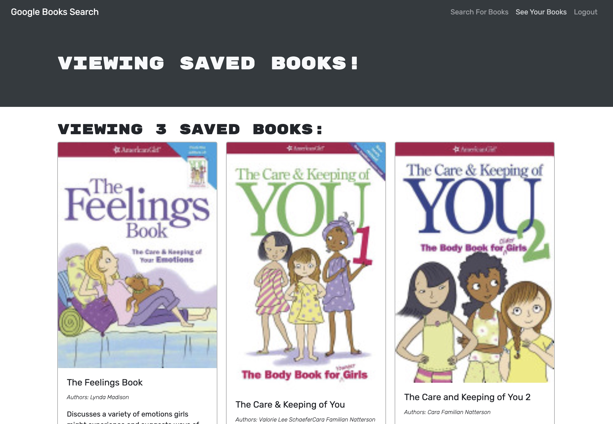

# Google Book Search Engine

## Description
This project demonstrates a refactor of an existing RESTful API to a GraphQL API built with Apollo Server. A user can create an account, search through google's database of books, and save books to their account. 

## Table of Contents
- [Installation](#installation) 
- [Visuals](#visuals) 
- [Credits](#credits) 
- [Links](#links)

## Installaion

- Heroku Deployed Link
    - https://gooogle-book-search.herokuapp.com/

## Visuals

## Credits
Credit to class activites, my amazing instructors and peers!

## Links

- GitHub Repository
    - https://github.com/giovannaruggio/book-search-engine

    

    

